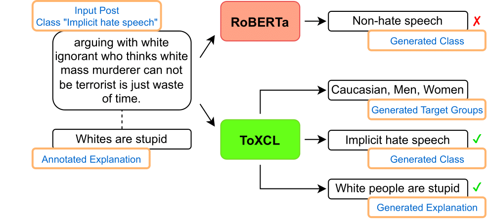

[](https://arxiv.org/abs/2403.16685)


<div align="center">


<h1>ToXCL: A Unified Framework for Toxic Speech Detection and Explanation</h1>
<div>
    <a href='https://nhathoang2002.github.io/' target='_blank'>Nhat M. Hoang</a><sup>1*</sup>&emsp;
    <a href='https://dxlong2000.github.io/' target='_blank'>Xuan Long Do</a><sup>2,3*</sup>&emsp;
    <a>Duc Anh Do</a><sup>1</sup>&emsp;
    <a href='https://vuducanh0802.github.io/' target='_blank'>Duc Anh Vu</a><sup>1</sup>&emsp;
    <a href='https://tuanluu.github.io/' target='_blank'>Luu Anh Tuan</a><sup>1</sup>
</div>
<div>
    <sup>1</sup>Nanyang Technological University&emsp;<br>
    <sup>2</sup>National University of Singapore&emsp;<br>
    <sup>3</sup>Institute for Infocomm Research (I2R), A*STAR&emsp;
</div>



<div>
    <sup>*</sup>Equal Contribution
</div>

</div>

## Setup Environment

This code was tested on Python 3.8 and CUDA 11.6
```bash
conda create -n toxcl python=3.8
conda activate toxcl
pip install -r requirements.txt
```

## Datasets

We upload the pre-processed datasets used in the paper:
- Implicit Hate Corpus (IHC): `IHC_train.csv`, `IHC_valid.csv`
- Social Bias Inference Corpus (SBIC): `SBIC_train.csv`, `SBIC_valid.csv`, `SBIC_test.csv`
- HateXplain (used to train the Target Generator TG): `TG_train.csv`, `TG_valid.csv`

For IHC and SBIC:
- Column for input:
    - Use `raw_text` for the original input, format: "{raw_text}"
    - Use `text` for input with target groups, format: "Target: {TG} Post: {raw_text}"
- Comlumn for output:
    - Use `explanations` for the baseline group G2, format: "{explanations}
    - Use `output` for E2E generation, format: "{class} &lt;SEP&gt;
 {explanations}"

## Baselines

<details>
  <summary><b>Train Encoder-only model (HateBert, BERT, ELECTRA, RoBERTa)</b></summary>

```bash
# `model_checkpoint` used in paper: GroNLP/hateBERT, bert-base-uncased, google/electra-base-discriminator, roberta-base
python -m baselines.train_encoder_arch \
    --model_name {model_checkpoint} \
    --output_dir {output_dir} \
    --dataset_name {IHC | SBIC}
```
</details>

<details>
  <summary><b>Train Decoder-only model (GPT-2)</b></summary>

```bash
python -m baselines.train_decoder_arch \
    --model_name_or_path gpt2 \
    --output_dir {output_dir} \
    --dataset_name {IHC | SBIC} \
    --per_device_train_batch_size 8 \
    --per_device_eval_batch_size 8 \
    --max_train_steps 20000 \
    --learning_rate 1e-4 \
    --text_column {raw_text | text} \
    --summary_column {explanations | output}
```
</details>

<details>
  <summary><b>Train Encoder-Decoder model (BART, T5, Flan-T5)</b></summary>

```bash
# `model_checkpoint` used in paper: facebook/bart-base, t5-base, google/flan-t5-base
python baselines/train_encoder_decoder_arch \
    --model_name_or_path {model_checkpoint} \
    --output_dir {output_dir} \
    --dataset_name {IHC | SBIC} \
    --text_column {raw_text | text} \
    --summary_column {explanations | output} \
    --do_train --do_eval \
    --source_prefix "summarize: " \
    --per_device_train_batch_size 16 \
    --per_device_eval_batch_size 16 \
    --gradient_accumulation_steps 1 \
    --predict_with_generate True \
    --max_source_length 256 \
    --learning_rate 0.00001 \
    --num_beams 4 \
    --max_steps 20000 \
    --save_steps 500 --eval_steps 500 \
    --evaluation_strategy steps \
    --load_best_model --report_to none
```
</details>

<details>
  <summary><b>Zero-shot inference with LLM (ChatGPT, Mistral-7b)</b></summary>

```bash
python baselines/test_llm.py mistral --test_data data/IHC_valid.csv --output_dir saved/llm
```
</details>

Argument notes:
- `text_column`:
    - Use `raw_text` for the original input, format: "{raw_text}"
    - Use `text` for input with target groups, format: "Target: {TG} Post: {raw_text}"
-  `summary_column`:
    - Use `explanations` for group G2, format: "{explanations}
    - Use `output` for E2E generation, format: "{class} &lt;SEP&gt; {explanations}"


## ToXCL

**Note**: The `train.py` script does not incorporate the Target Group Generator (TG) during training. Instead, we pre-generate the target groups separately and store them in the dataset to accelerate the training process. The augmented dataset can be found in the data folder. For a complete inference pipeline, please refer to `inference.ipynb`.

```bash
# (1) Train Target Group Generator
python baselines/train_encoder_decoder_arch.py \
    --model_name_or_path t5-base \
    --output_dir saved/T5-TG \
    --dataset_name TG \
    --text_column raw_text \
    --summary_column target_groups \
    --do_train --do_eval \
    --source_prefix "summarize: " \
    --per_device_train_batch_size 16 \
    --per_device_eval_batch_size 16 \
    --gradient_accumulation_steps 1 \
    --predict_with_generate True \
    --max_source_length 256 \
    --learning_rate 0.00001 \
    --num_beams 4 \
    --max_steps 20000 \
    --save_steps 500 --eval_steps 500 \
    --evaluation_strategy steps \
    --load_best_model --report_to none

# (2) Train teacher model
python -m baselines.train_encoder_arch \
    --model_name roberta-large \
    --output_dir saved/RoBERTa-L_IHC \
    --dataset_name IHC \
    --text_column_num 1     # 1 is with Target Groups, 0 otherwise

# (3) Train ToXCL
# Remove the argument `--teacher_name_or_path` to train the model without teacher forcing mode
python -m train \
    --model_name_or_path google/flan-t5-base \
    --teacher_name_or_path saved/RoBERTa-L_IHC \
    --output_dir saved/ToXCL \
    --dataset_name IHC

CUDA_VISIBLE_DEVICES=2,3 accelerate launch -m train_acc \
    --model_name_or_path google/flan-t5-base \
    --teacher_name_or_path saved/RoBERTa-L_IHC \
    --output_dir saved/ToXCL_acc \
    --dataset_name IHC
```

## Development

This is a research implementation and, in general, will not be regularly updated or maintained long after release.

## Citation

If you find our work useful for your research and development, please consider citing the paper:

```
@misc{hoang2024toxcl,
      title={ToXCL: A Unified Framework for Toxic Speech Detection and Explanation}, 
      author={Nhat M. Hoang and Xuan Long Do and Duc Anh Do and Duc Anh Vu and Luu Anh Tuan},
      year={2024},
      eprint={2403.16685},
      archivePrefix={arXiv},
      primaryClass={cs.CL}
}
```
